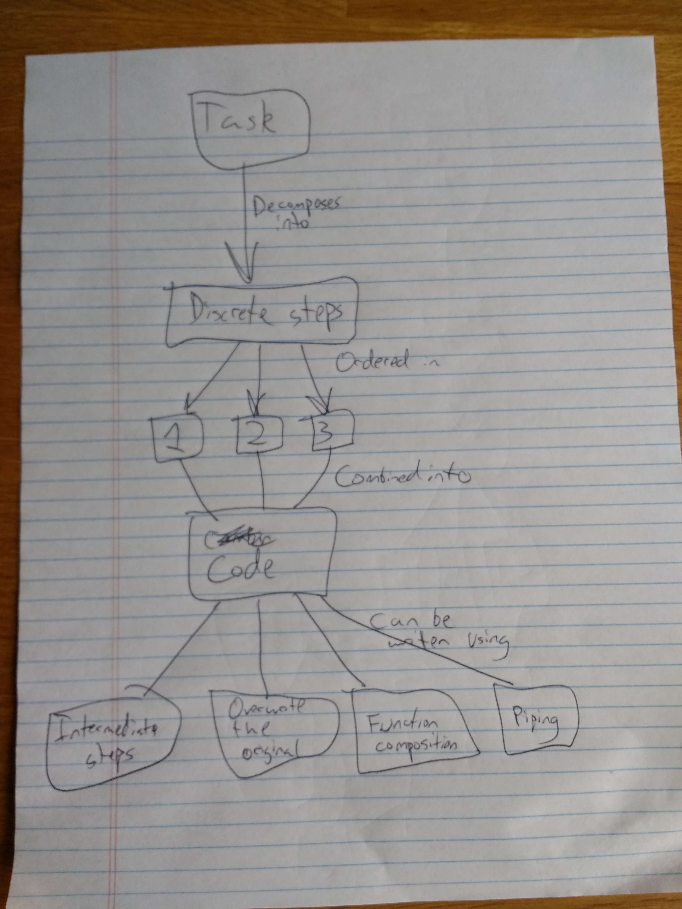

Pipes in R
================

  - [Learner persona](#learner-persona)
      - [Fang](#fang)
  - [Concept map for exercise](#concept-map-for-exercise)
  - [Pipes](#pipes)
      - [Intermediate steps](#intermediate-steps)
      - [Overwrite the original](#overwrite-the-original)
      - [Function composition](#function-composition)
      - [Back to the pipe](#back-to-the-pipe)
      - [Important tips for piping](#important-tips-for-piping)
  - [Assessment of knowledge](#assessment-of-knowledge)
      - [Intermediate steps](#intermediate-steps-1)
      - [Function composition](#function-composition-1)
      - [Piped operation](#piped-operation)
  - [Session Info](#session-info)

# Learner persona

### Fang


  - General background
      - Born and raised in Shenzhen, China
      - First time living in the United States
      - Improves her English skills by watching the Great British
        Bake-Off (but was heartbroken when Mary Berry, Mel, and Sue
        left)
  - Starting points
      - Background in psychology, plans to apply for doctoral programs
        in marketing
      - Uses a mix of Excel, SPSS, and Matlab
      - Is pursuing the [graduate certificate in computational social
        science](https://macss.uchicago.edu/content/certificate-current-students)
  - Needs
      - Is going to run 300 experiments on Amazon MTurk in the next six
        months
      - Wants to easily share her analysis notebooks with peers in her
        research lab
      - Expects to take courses in machine learning and Bayesian
        statistics which require a background in R

# Concept map for exercise



# Pipes

Pipes are an extremely useful tool from the `magrittr` package\[1\] that
allow you to express a sequence of multiple operations. They can greatly
simplify your code and make your operations more intuitive. However they
are not the only way to write your code and combine multiple operations.
In fact, for many years the pipe did not exist in R. How else did people
write their code?

Suppose we have the following task:

> Using the `diamonds` dataset, calculate the average price for each cut
> of “I” colored diamonds.

Okay, first let’s load our libraries and check out the data frame.

``` r
library(tidyverse)
data("diamonds")
diamonds
```

    ## # A tibble: 53,940 x 10
    ##    carat cut       color clarity depth table price     x     y     z
    ##    <dbl> <ord>     <ord> <ord>   <dbl> <dbl> <int> <dbl> <dbl> <dbl>
    ##  1 0.23  Ideal     E     SI2      61.5    55   326  3.95  3.98  2.43
    ##  2 0.21  Premium   E     SI1      59.8    61   326  3.89  3.84  2.31
    ##  3 0.23  Good      E     VS1      56.9    65   327  4.05  4.07  2.31
    ##  4 0.290 Premium   I     VS2      62.4    58   334  4.2   4.23  2.63
    ##  5 0.31  Good      J     SI2      63.3    58   335  4.34  4.35  2.75
    ##  6 0.24  Very Good J     VVS2     62.8    57   336  3.94  3.96  2.48
    ##  7 0.24  Very Good I     VVS1     62.3    57   336  3.95  3.98  2.47
    ##  8 0.26  Very Good H     SI1      61.9    55   337  4.07  4.11  2.53
    ##  9 0.22  Fair      E     VS2      65.1    61   337  3.87  3.78  2.49
    ## 10 0.23  Very Good H     VS1      59.4    61   338  4     4.05  2.39
    ## # … with 53,930 more rows

We can **decompose the problem** into a series of discrete steps:

1.  Filter `diamonds` to only keep observations where the color is rated
    as “I”
2.  Group the filtered `diamonds` data frame by cut
3.  Summarize the grouped and filtered `diamonds` data frame by
    calculating the average price

But how do we implement the code?

## Intermediate steps

One option is to save each step as a new object:

``` r
diamonds_1 <- filter(diamonds, color == "I")
diamonds_2 <- group_by(diamonds_1, cut)
diamonds_3 <- summarize(diamonds_2, price = mean(price))
diamonds_3
```

    ## # A tibble: 5 x 2
    ##   cut       price
    ##   <ord>     <dbl>
    ## 1 Fair      4685.
    ## 2 Good      5079.
    ## 3 Very Good 5256.
    ## 4 Premium   5946.
    ## 5 Ideal     4452.

Why do we not like doing this? **We have to name each intermediate
object**. Here I just append a number to the end, but this is not good
self-documentation. What should we expect to find in `diamond_2`? It
would be nicer to have an informative name, but there isn’t a natural
one. Then we have to remember how the data exists in each intermediate
step and remember to reference the correct one. What happens if we
misidentify the data frame?

``` r
diamonds_1 <- filter(diamonds, color == "I")
diamonds_2 <- group_by(diamonds_1, cut)
diamonds_3 <- summarize(diamonds_1, price = mean(price))
diamonds_3
```

    ## # A tibble: 1 x 1
    ##   price
    ##   <dbl>
    ## 1 5092.

We don’t get the correct answer. Worse, we don’t get an explicit error
message because the code, as written, works. R can execute this command
for us and doesn’t know to warn us that we used `diamonds_1` instead of
`diamonds_2`.

## Overwrite the original

Instead of creating intermediate objects, let’s just replace the
original data frame with the modified form.

``` r
diamonds <- filter(diamonds, color == "I")
diamonds <- group_by(diamonds, cut)
(diamonds <- summarize(diamonds, price = mean(price)))
```

    ## # A tibble: 5 x 2
    ##   cut       price
    ##   <ord>     <dbl>
    ## 1 Fair      4685.
    ## 2 Good      5079.
    ## 3 Very Good 5256.
    ## 4 Premium   5946.
    ## 5 Ideal     4452.

This works, but still has a couple of problems. What happens if I make
an error in the middle of the operation? I need to rerun the entire
operation from the beginning. With your own data sources, this means
having to read in the `.csv` file all over again to restore a fresh
copy.

## Function composition

We could string all the function calls together into a single object and
forget assigning it anywhere.

``` r
data("diamonds")      # reload diamonds dataset

summarize(
  group_by(
    filter(diamonds, color == "I"),
    cut
  ),
  price = mean(price)
)
```

    ## # A tibble: 5 x 2
    ##   cut       price
    ##   <ord>     <dbl>
    ## 1 Fair      4685.
    ## 2 Good      5079.
    ## 3 Very Good 5256.
    ## 4 Premium   5946.
    ## 5 Ideal     4452.

But now we have to read the function from the inside out. Even worse,
what happens if we cram it all into a single line?

``` r
summarize(group_by(filter(diamonds, color == "I"), cut), price = mean(price))
```

    ## # A tibble: 5 x 2
    ##   cut       price
    ##   <ord>     <dbl>
    ## 1 Fair      4685.
    ## 2 Good      5079.
    ## 3 Very Good 5256.
    ## 4 Premium   5946.
    ## 5 Ideal     4452.

**This is not intuitive for humans**. Again, the computer will handle it
just fine, but if you make a mistake debugging it will be a pain.

## Back to the pipe

``` r
diamonds %>%
  filter(color == "I") %>%
  group_by(cut) %>%
  summarize(price = mean(price))
```

    ## # A tibble: 5 x 2
    ##   cut       price
    ##   <ord>     <dbl>
    ## 1 Fair      4685.
    ## 2 Good      5079.
    ## 3 Very Good 5256.
    ## 4 Premium   5946.
    ## 5 Ideal     4452.

Piping is the clearest syntax to implement, as it focuses on actions,
not objects. Or as [Hadley would
say](http://r4ds.had.co.nz/pipes.html#use-the-pipe):

> \[I\]t focuses on verbs, not nouns.

`magrittr` automatically passes the output from the first line into the
next line as the input. This is why `tidyverse` functions always accept
a data frame as the first argument.

## Important tips for piping

  - Remember though that you don’t assign anything within the pipes -
    that is, you should not use `<-` inside the piped operation. Only
    use this at the beginning if you want to save the output
  - Remember to add the pipe `%>%` at the end of each line involved in
    the piped operation. A good rule of thumb: RStudio will
    automatically indent lines of code that are part of a piped
    operation. If the line isn’t indented, it probably hasn’t been added
    to the pipe. **If you have an error in a piped operation, always
    check to make sure the pipe is connected as you expect**.

# Assessment of knowledge

Using `gun_deaths` from the `rcfss` library,\[2\] answer the following
question:

> For each education category, how many white males where killed in
> 2012?

In the sections below, I provide solution code using three different
composition methods but the code is out of order. Rearrange the lines of
code to generate the correct answer.

``` r
library(rcfss)
data("gun_deaths")
gun_deaths
```

    ## # A tibble: 100,798 x 10
    ##       id  year month intent   police sex     age race      place  education
    ##    <dbl> <dbl> <chr> <chr>     <dbl> <chr> <dbl> <chr>     <chr>  <fct>    
    ##  1     1  2012 Jan   Suicide       0 M        34 Asian/Pa… Home   <NA>     
    ##  2     2  2012 Jan   Suicide       0 F        21 White     Street <NA>     
    ##  3     3  2012 Jan   Suicide       0 M        60 White     Other… <NA>     
    ##  4     4  2012 Feb   Suicide       0 M        64 White     Home   <NA>     
    ##  5     5  2012 Feb   Suicide       0 M        31 White     Other… <NA>     
    ##  6     6  2012 Feb   Suicide       0 M        17 Native A… Home   <NA>     
    ##  7     7  2012 Feb   Undeter…      0 M        48 White     Home   <NA>     
    ##  8     8  2012 Mar   Suicide       0 M        41 Native A… Home   <NA>     
    ##  9     9  2012 Feb   Acciden…      0 M        50 White     Other… <NA>     
    ## 10    10  2012 Feb   Suicide       0 M        NA Black     Home   <NA>     
    ## # … with 100,788 more rows

## Intermediate steps

``` r
gun_deaths2 <- group_by(gun_deaths1, education)
gun_deaths1 <- filter(gun_deaths, sex == "M", race == "White", year == 2012)
gun_deaths3 <- summarize(gun_deaths2, n = n())
```

<details>

<summary>Click for the solution</summary>

<p>

``` r
gun_deaths1 <- filter(gun_deaths, sex == "M", race == "White", year == 2012)
gun_deaths2 <- group_by(gun_deaths1, education)
```

    ## Warning: Factor `education` contains implicit NA, consider using
    ## `forcats::fct_explicit_na`

``` r
gun_deaths3 <- summarize(gun_deaths2, n = n())
```

</p>

</details>

## Function composition

``` r
education),
group_by(
summarize(
n = n()
filter(gun_deaths, sex == "M", race == "White", year == 2012),
)
```

<details>

<summary>Click for the solution</summary>

<p>

``` r
summarize(
group_by(
filter(gun_deaths, sex == "M", race == "White", year == 2012),
education),
n = n()
)
```

    ## Warning: Factor `education` contains implicit NA, consider using
    ## `forcats::fct_explicit_na`

    ## # A tibble: 1 x 2
    ##   education     n
    ##   <fct>     <int>
    ## 1 <NA>      18342

</p>

</details>

## Piped operation

``` r
group_by(education) %>%
filter(sex == "M", race == "White", year == 2012) %>%
summarize(n = n())
gun_deaths %>%
```

<details>

<summary>Click for the solution</summary>

<p>

``` r
gun_deaths %>%
filter(sex == "M", race == "White", year == 2012) %>%
group_by(education) %>%
summarize(n = n())
```

    ## Warning: Factor `education` contains implicit NA, consider using
    ## `forcats::fct_explicit_na`

    ## # A tibble: 1 x 2
    ##   education     n
    ##   <fct>     <int>
    ## 1 <NA>      18342

</p>

</details>

# Session Info

``` r
devtools::session_info()
```

    ## ─ Session info ──────────────────────────────────────────────────────────
    ##  setting  value                       
    ##  version  R version 3.6.0 (2019-04-26)
    ##  os       macOS Mojave 10.14.6        
    ##  system   x86_64, darwin15.6.0        
    ##  ui       X11                         
    ##  language (EN)                        
    ##  collate  en_US.UTF-8                 
    ##  ctype    en_US.UTF-8                 
    ##  tz       America/Chicago             
    ##  date     2019-09-28                  
    ## 
    ## ─ Packages ──────────────────────────────────────────────────────────────
    ##  package     * version date       lib source        
    ##  assertthat    0.2.1   2019-03-21 [1] CRAN (R 3.6.0)
    ##  backports     1.1.4   2019-04-10 [1] CRAN (R 3.6.0)
    ##  callr         3.3.1   2019-07-18 [1] CRAN (R 3.6.0)
    ##  cli           1.1.0   2019-03-19 [1] CRAN (R 3.6.0)
    ##  crayon        1.3.4   2017-09-16 [1] CRAN (R 3.6.0)
    ##  desc          1.2.0   2018-05-01 [1] CRAN (R 3.6.0)
    ##  devtools      2.2.0   2019-09-07 [1] CRAN (R 3.6.0)
    ##  digest        0.6.20  2019-07-04 [1] CRAN (R 3.6.0)
    ##  DT            0.8     2019-08-07 [1] CRAN (R 3.6.0)
    ##  ellipsis      0.2.0.1 2019-07-02 [1] CRAN (R 3.6.0)
    ##  evaluate      0.14    2019-05-28 [1] CRAN (R 3.6.0)
    ##  fs            1.3.1   2019-05-06 [1] CRAN (R 3.6.0)
    ##  glue          1.3.1   2019-03-12 [1] CRAN (R 3.6.0)
    ##  htmltools     0.3.6   2017-04-28 [1] CRAN (R 3.6.0)
    ##  htmlwidgets   1.3     2018-09-30 [1] CRAN (R 3.6.0)
    ##  knitr         1.24    2019-08-08 [1] CRAN (R 3.6.0)
    ##  magrittr      1.5     2014-11-22 [1] CRAN (R 3.6.0)
    ##  memoise       1.1.0   2017-04-21 [1] CRAN (R 3.6.0)
    ##  pkgbuild      1.0.5   2019-08-26 [1] CRAN (R 3.6.0)
    ##  pkgload       1.0.2   2018-10-29 [1] CRAN (R 3.6.0)
    ##  prettyunits   1.0.2   2015-07-13 [1] CRAN (R 3.6.0)
    ##  processx      3.4.1   2019-07-18 [1] CRAN (R 3.6.0)
    ##  ps            1.3.0   2018-12-21 [1] CRAN (R 3.6.0)
    ##  R6            2.4.0   2019-02-14 [1] CRAN (R 3.6.0)
    ##  Rcpp          1.0.2   2019-07-25 [1] CRAN (R 3.6.0)
    ##  remotes       2.1.0   2019-06-24 [1] CRAN (R 3.6.0)
    ##  rlang         0.4.0   2019-06-25 [1] CRAN (R 3.6.0)
    ##  rmarkdown     1.15    2019-08-21 [1] CRAN (R 3.6.0)
    ##  rprojroot     1.3-2   2018-01-03 [1] CRAN (R 3.6.0)
    ##  sessioninfo   1.1.1   2018-11-05 [1] CRAN (R 3.6.0)
    ##  stringi       1.4.3   2019-03-12 [1] CRAN (R 3.6.0)
    ##  stringr       1.4.0   2019-02-10 [1] CRAN (R 3.6.0)
    ##  testthat      2.2.1   2019-07-25 [1] CRAN (R 3.6.0)
    ##  usethis       1.5.1   2019-07-04 [1] CRAN (R 3.6.0)
    ##  withr         2.1.2   2018-03-15 [1] CRAN (R 3.6.0)
    ##  xfun          0.9     2019-08-21 [1] CRAN (R 3.6.0)
    ##  yaml          2.2.0   2018-07-25 [1] CRAN (R 3.6.0)
    ## 
    ## [1] /Library/Frameworks/R.framework/Versions/3.6/Resources/library

1.  The basic `%>%` pipe is automatically imported as part of the
    `tidyverse` library. If you wish to use any of the [extra tools from
    `magrittr` as demonstrated in R for Data
    Science](http://r4ds.had.co.nz/pipes.html#other-tools-from-magrittr),
    you need to explicitly load `magrittr`.

2.  To install the package, run the command
    `devtools::install_github("uc-cfss/rcfss")` in the console.
